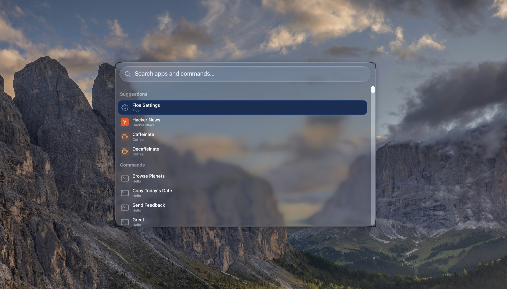

# Floe

<!-- Badges: shieldcn, as in Thaw's README (light/dark) -->
<p align="center">
  <a href="https://discord.gg/KDfWjWDnR4"><picture><source media="(prefers-color-scheme: dark)" srcset="https://www.shieldcn.dev/badge/Discord-join.svg?variant=outline&amp;size=xs&amp;mode=dark&amp;font=geist&amp;logo=discord&amp;" /></picture></a>
  <a href="https://sonarcloud.io/summary/overall?id=thaw-app_Floe"><picture><source media="(prefers-color-scheme: dark)" srcset="https://www.shieldcn.dev/sonar/quality-gate/thaw-app_Floe.svg?variant=outline&amp;size=xs&amp;mode=dark&amp;font=geist&amp;logo=sonarqubecloud" /></picture></a>
  <a href="https://sonarcloud.io/component_measures?id=thaw-app_Floe&amp;metric=reliability_rating"><picture><source media="(prefers-color-scheme: dark)" srcset="https://www.shieldcn.dev/sonar/reliability/thaw-app_Floe.svg?variant=outline&amp;size=xs&amp;mode=dark&amp;font=geist&amp;logo=sonarqubecloud" /></picture></a>
  <a href="https://sonarcloud.io/component_measures?id=thaw-app_Floe&amp;metric=security_rating"><picture><source media="(prefers-color-scheme: dark)" srcset="https://www.shieldcn.dev/sonar/security/thaw-app_Floe.svg?variant=outline&amp;size=xs&amp;mode=dark&amp;font=geist&amp;logo=sonarqubecloud" /></picture></a>
  <a href="https://sonarcloud.io/component_measures?id=thaw-app_Floe&amp;metric=sqale_rating"><picture><source media="(prefers-color-scheme: dark)" srcset="https://www.shieldcn.dev/sonar/maintainability/thaw-app_Floe.svg?variant=outline&amp;size=xs&amp;mode=dark&amp;font=geist&amp;logo=sonarqubecloud" /></picture></a>
</p>

<p align="center">
  <b>The open source launcher for macOS.</b>
</p>

<p align="center">
  <a href="#features">Features</a> ·
  <a href="#build">Build</a> ·
  <a href="#not-built-yet">Not built yet</a> ·
  <a href="CHANGELOG.md">Changelog</a> ·
  <a href="https://discord.gg/KDfWjWDnR4">Discord</a> ·
  <a href="#license">License</a>
</p>

<p align="center">
  
</p>

## Features

Floe is early. There are no releases yet, so [build it from source](#build), and [Not built yet](#not-built-yet) lists what is missing.

### Search

- One hotkey opens a search over applications, commands, quicklinks and System Settings panes, ranked by how often and how recently you use them.
- Scattered letters match, graded by word starts and runs, and the matched letters are marked.
- Aliases and hotkeys for applications, commands and the menu bar search. Favorites stay at the top.
- Scopes narrow a search to one place: `files invoice`, `clipboard meeting`, `menu wifi`, `tabs invoice`.
- An Actions menu (⌘K) on applications and files: quit, show in Finder, open with, copy, move to Trash.
- A compact layout that is only the search bar until you type.

### Extensions

- Raycast extensions run unmodified, including the ones Raycast has already installed, on a Bun runtime that ships inside the app.
- Forms, preferences, arguments, toasts, confirmation dialogs, and background and interval commands work. Passwords go in the Keychain.
- Menu bar commands, each added to the menu bar by running it or from Settings.
- An Extension Store page to browse, install and update extensions, and hot reload while you develop one.
- When a command throws, crashes or hangs, Floe shows the log and lets you run it again.

### Built in

- Clipboard history, snippets with text expansion, quicklinks with fallback searches, emoji and symbols.
- File search, calendar events, and a calculator with unit conversion.
- The menu bar's items, searched and opened from the keyboard.
- System commands (sleep, lock, empty Trash) and toggles for Wi-Fi, mute and keeping the Mac awake.
- A preferred terminal, editor and notes app: open a file, a folder or the Finder selection in the ones you already use, and send `note` and some text to Apple Notes, Antinote, or any app with a URL scheme.
- A preferred clipboard app: if you already use a clipboard manager, Clipboard History opens it (Raycast by name, any other app, or a link) and Floe stops saving copies of its own.
- Script commands, and a picker for your own scripts: `ls | Floe --pick` shows the lines in the search panel and prints the one you choose.

### AI

- Ask AI: `ask` and a question, or the Ask AI row under any search, shows one answer in the launcher, with a line that says who answered and whether it stayed on your Mac. No history is kept.
- You choose who answers, for Ask AI and for extensions that call `AI.ask`: the `claude` or `codex` tool you are signed in to, Apple Intelligence on your Mac, or an OpenAI-compatible API (OpenAI or OpenRouter with your key, Ollama or LM Studio without one).
- A switch keeps all AI on your Mac, and one extension can be pinned to a source of its own.

### With Thaw

- [Thaw](https://github.com/thaw-app/Thaw) 3's actions in the search when Thaw is installed: the hidden sections, swap, Zen Mode, the Thaw Bar, the layout and the application menus.
- The launcher can follow Thaw's menu bar appearance: its tint, glass, border and shadow.
- Built on ThawUI, Thaw's design system.

## Transparency

- Free and open source, AGPL-3.0. Read the code, build it yourself, fork it.
- No analytics, no telemetry, no account.
- The Privacy page in Settings lists every permission with its reasons and everything Floe contacts over the network: update checks, GitHub and the npm registry for the Extension Store, and the AI source you chose.
- Search sources that read other apps (files, browser tabs) are off until you turn them on.
- Extensions run under your user account without a sandbox. Install only the ones you trust.

## Build

Floe needs macOS 26 or later, Xcode 27 and [Bun](https://bun.sh).

```sh
cd runtime && bun install && cd ..
./scripts/devrun.sh
```

[Development](docs/DEVELOPMENT.md) has the rest: the layout of the tree, the tests, the diagnostics and how releases are made.

## Not built yet

### Extensions

- [ ] OAuth sign-in (GitHub, Notion, Linear, Spotify, Todoist). The client is written and parked; extensions use a token preference for now
- [ ] `launchCommand` and deeplinks
- [ ] AI tools
- [ ] Grid layout and full detail metadata
- [ ] Swift and Rust helpers in extensions built from source

### Built in

- [ ] Currency conversion in the calculator
- [ ] Searching the notes in your notes app
- [ ] Search an app's menus
- [ ] AI chat

### App

- [ ] Settings sync
- [ ] Signed and notarized releases with updates

## Contributing

Read the shared [Thaw/Floe contribution policy](https://github.com/thaw-app/.github/blob/main/.github/CONTRIBUTING.md), [Security Policy](https://github.com/thaw-app/.github/blob/main/.github/SECURITY.md), and [Code of Conduct](https://github.com/thaw-app/.github/blob/main/.github/CODE_OF_CONDUCT.md). Build commands and tests are in [Development](docs/DEVELOPMENT.md).

<p align="center">
  <a href="https://github.com/thaw-app/Floe/graphs/contributors"></a>
</p>

## Project documentation

- [Changelog](CHANGELOG.md)
- [Development](docs/DEVELOPMENT.md)
- [Credits](CREDITS.md)
- [Licenses](LICENSES/README.md)
- [Contributing](https://github.com/thaw-app/.github/blob/main/.github/CONTRIBUTING.md)
- [Security policy](https://github.com/thaw-app/.github/blob/main/.github/SECURITY.md)

## Acknowledgments

Floe stands on three projects in particular:

- [Thaw](https://github.com/thaw-app/Thaw), by Toni Förster and contributors: the ThawUI design system, the hotkey code, the HUD, the glass styles, the diagnostic logger, the release notes reader, and the designs for the search panel, the settings window and the Privacy and About pages.
- [Droppy Code](https://getdroppycode.app), by Jordy Spruit: the login shell environment, the process runner, the tools and the streamed requests that answer AI, the hang watchdog and the folder watcher behind hot reload, each modified for Floe.
- [Raycast extensions](https://github.com/raycast/extensions), whose API Floe implements. Each extension keeps its own license.

[Credits](CREDITS.md) lists every package Floe is built from, with its version and license.

Raycast is a trademark of Raycast Technologies Inc. Floe is not affiliated with Raycast.

## License

Floe is available under the [AGPL-3.0 license](LICENSE). The code ported from Thaw stays under GPL-3.0, and the code ported from Droppy Code is AGPL-3.0 with attribution terms. [LICENSES](LICENSES/README.md) says which license covers which folder and holds the texts.
